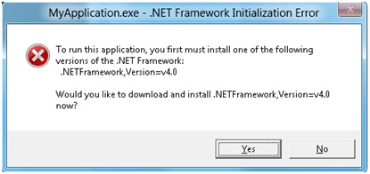

+++
title = ".NET Core, .NET Standard ve Felsefe Taşı - Part I"
date = "2017-10-28"
description = "Bu yazı dizisinde daha çok, .NET Core ve .NET Standart’ın kendilerini, ortaya çıkmalarındaki nedenleri, ekosistemde yapacakları değişiklikleri ve bizim bu değişikliklere nasıl ayak uydurmamız gerektiği ile ilgili konuşacağız."
tags = [
    ".net",
    ".net core",
    ".net standard",
    ".net framework",
    "felsefe taşı",
    "part",
    "clr",
    "common language runtime",
    "gc",
    "garbage collector",
    "jit compiler",
    "just in time compiler",
    "core fx",
    ".net native",
    "vNext",
    "cross platform",
    "asp.net",
    "pcl",
    "portable class libraries",
    "xamarin"
]
+++

Merak etmeyin, bu yazının ne Harry Potter, ne de maddeyi altına dönüştürme ile bir ilgisi yok. Bu yazı dizisinde daha çok, .NET Core ve .NET Standart’ın kendilerini, ortaya çıkmalarındaki nedenleri, ekosistemde yapacakları değişiklikleri ve bizim bu değişikliklere nasıl ayak uydurmamız gerektiği ile ilgili konuşacağız.

## Giriş

Yakın zamanda [.NET Core 2.0](https://blogs.msdn.microsoft.com/dotnet/2017/08/14/announcing-net-core-2-0/) ve [ASP.NET Core 2.0](https://blogs.msdn.microsoft.com/webdev/2017/08/14/announcing-asp-net-core-2-0/) duyuruldu. Bir çok değişiklik ve güzel haber var fakat boşverin, şimdi oradan kopup, biraz daha geriye, bütün bunların başladığı zamana gidelim. Fazla değil Kasım 2014’te Microsoft, [.NET Core’u (CoreFX) Open Source yaptı](https://blogs.msdn.microsoft.com/dotnet/2014/11/12/net-core-is-open-source/). Tabii kimse .NET Core’un ne olduğunu bilmiyordu. Blog yazısında, aslında bu teknolojinin içeride ASP.NET 5 (vNext) ve .NET Native’de -ki başlı başına ayrı bir konu- hali hazırda kullandıklarını, gelecekte .NET platformunun temel taşının bu yapı olacağını söylediler. Open Source olmasındaki sebep ise, .NET’in arkasında daha güçlü bir ekosistem oluşturmak ve cross-platform bir hale getirmek için hazırlıklara başlamaktı..NET Core’un arkasındaki ana sebep ise, .NET Framework yaklaşımının pek de doğru olmaması ve bunu değiştirmeye yönelik çalışmalar yaparken de aynı zamanda zaten olması gereken cross-platform desteğini de göz önünde bulundurmaktı. İki amaç da zamana göre daha fazla önem kazanabilir..NET Core’un alt yapısını anlatmadan önce size .NET Framework yaklaşımını ve yanında getirdiği problemleri biraz daha açmam gerek.

## Bir Sorunun Tanımı

Yukarıdaki ekranı hatırladınız değil mi? Hiç görmediyseniz eğer ne mutlu size, [bugünün şanslı 10.000 kişisinden birisiniz](https://xkcd.com/1053/). Özetlemek gerekirse, yüklediğiniz bir uygulama, çalışmak için .NET Framework’ü gerektiriyor ve önce onu yüklemeniz gerek. Bunun sadece Windows içerisinde karşılaşılan bir durum olduğunu söylemiyorum, keza diğer sistemlerde yüklediğiniz paketler, başka paketleri gereksinim olarak isteyebiliyor, fakat buradaki ana sorun teknik değil. Ana sorun, yukarıdaki problemin son kullanıcı tarafından çözülmesinin beklenmesi. Aynı zamanda bu paket öyle elzem ki, bütün .NET uygulamaları[^1] kullanıyor ve versiyonları var. Uygulama hangi versiyonu kullanıyorsa ona göre yüklenmesi gerek. Yukarıdaki Yes butonuna basınca sizi o paketin indirme sayfasına yönlendiriyor, siz de inen paketi kuruyorsunuz. Tabii paket kullandığınız işletim sistemi tarafından destekleniyorsa. Örneğin Windows 7 kullandığınızı varsayarsak ve açmaya çalıştığınız uygulama .NET Framework 4.6 kullanıyorsa eğer, SP1 yükseltmesini önceden yapmış olmanız gerek. Yapmamışsanız uygulama **çalışmıyor**. Yani bir uygulamayı kullanmak için önce sistem güncellemesi, sonra paket kurulumu ve en sonunda kullanmak istediğiniz uygulamanın kurulumunu yapmanız gerekebilir. Bu arada bütün bunları teknik bilgisi fazla olmayan birinin yapmaya çalıştını düşünürseniz, durum pek iç açıcı değil.Diğer bir sorun, bu kütüphanenin içerisinde herşeyin olması. Siz bir uygulama yazarken sadece küçük bir kısmını bile kullansanız, bu o uygulamanın .NET Framework kullandığı gerçeğini değiştirmiyor. .NET Framework 4.6’nın kurulum paketi 62.4 MB. Kurulum sonrası boyutu 100 MB’ı aşıyor. Amacı iki sayı toplamak olan bir konsol uygulamasının çalışması için de bu kütüphanenin kurulması gerek.Ha bu arada yukarıdaki bu iki uygulama da diğer işletim sistemlerinde çalışmıyor.Sanırım yavaş yavaş problemin kaynağının ne olduğunu ve nasıl çözülebileceğini düşünmeye başlamışsınızdır. Öyle bir şey olmalı ki, uygulama herhangi bir dış kaynağa gereksinim duymamalı, yani kullandığı paketleri yanında götürmeli.

[^1]: Bütün .NET Framework uygulamaları yani WinForm, WPF, ASP.NET gibi.

## Bir Efsanenin Doğuşu

.NET Core işte bu fikrin hayata geçmiş hali. Tabi şu “kullandığı paketleri yanında götürmesi” kısmı için .NET Framework parçalara ayrıldı ve çoğu paket NuGet üzerinden referans edilebilir hale getirildi. En temel parçalar ([CLR](https://github.com/dotnet/coreclr) ve içerisindeki GC ve JIT) ise cross-platform çalışması için baştan yazıldı ve .NET Core CLR oluştu. Tabii hepsinin cross-platform çalışması için değiştirilen bir çok yaklaşım da oldu.

## Peki Web?

ASP.NET 5 (vNext) yani ASP.NET Core ise, .NET Core’un üzerine ASP.NET mimarisinin bindirilmesi ile oluşmuş bir platform. Ocak 2016’ta ASP.NET 5 adı ASP.NET Core olarak [değiştirildi](https://www.hanselman.com/blog/ASPNET5IsDeadIntroducingASPNETCore10AndNETCore10.aspx) çünkü ASP.NET  5 sanki ASP.NET 4.5’in bir üst versiyonu gibi anlaşılıyordu. Halbuki ASP.NET 5,  yapısal anlamda ASP.NET 4.5’i andırmıyordu bile ve bu insanlarda kafa karışıklığı yaratabilirdi. Bu sebeple isim değişikliğine gidildi.

## Soru İşaretleri

Peki .NET Standart bunun neresinde. Bugün itibarıyla üç tane .NET platformu var; .NET Framework, .NET Core ve Xamarin. Her birisinin amacı ve kullandıkları altyapılar farklı. Tabii bu kullanılan dil aynı olsa bile oluşan paket uyuşmazlığı, yazılan kodların platformlar arası kullanılmasını engelliyor. Zaten her biri programlayan kişiye farklı API’lar sunuyor. Yani her türlü yazılan kod belirli bir platforma özel olmuş oluyor. Bu sorunu çözmek için üretilen [PCL](https://docs.microsoft.com/en-us/dotnet/standard/cross-platform/cross-platform-development-with-the-portable-class-library) ise sorunu daha da büyük bir hale getiriyor.Part II’de ise .NET Standart’ın ne olduğunu ve yukarıdaki probleme nasıl bir çözüm getirdiğini göreceğiz.