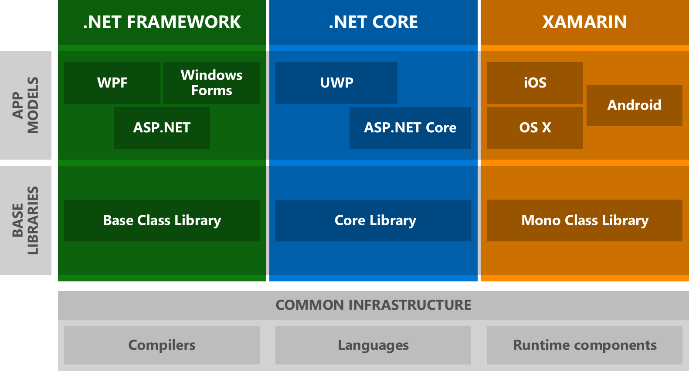
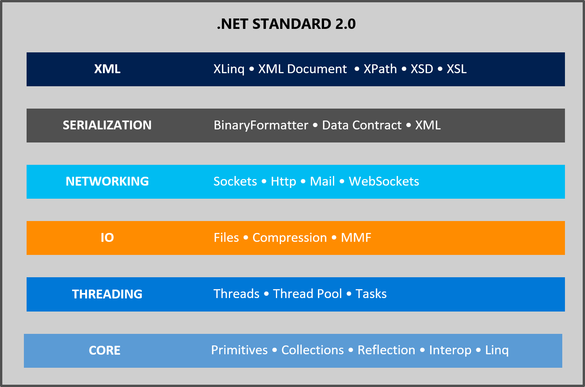

+++
title = ".NET Core, .NET Standard ve Felsefe Taşı - Part II"
date = "2017-11-30"
description = ".NET Standard neden var? Ondan öncesinde PCL’ler neden var diye sormamız gerekiyor değil mi?"
tags = [
    ".net",
    ".net core",
    ".net standard",
    ".net framework",
    "felsefe taşı",
    "part",
    "clr",
    "common language runtime",
    "gc",
    "garbage collector",
    "jit compiler",
    "just in time compiler",
    "core fx",
    ".net native",
    "vNext",
    "cross platform",
    "asp.net",
    "pcl",
    "portable class libraries",
    "xamarin"
]
+++

[Previously on](https://www.youtube.com/watch?v=eX-BCKutDh0) : [.NET Core, .NET Standard ve Felsefe Taşı – Part I](../.net-core-.net-standard-ve-felsefe-taşı-part-i)

> “It does not do to dwell on dreams and forget to live.” ― J.K. Rowling, Harry Potter and the Sorcerer’s Stone

J.K. Rowling’in de dediği gibi, hayal dünyasının içerisinde hayat sürüp yaşamayı unutmak pek olmuyor. İşte PCL’ler hayatımıza böyle girmişti fakat, hayal dünyasının içerisinde, yani teoride mantıklı bir yaklaşım, gerçek hayata uyarlandığında pek de tutarlı olmadı, olamadı. Çok mu abarttım? Olabilir. Ama bu ortada çözülmesi gereken bir durumun olduğu gerçeğini değiştirmiyor.

## Soruyu tekrar alabilir miyim?

Ha, şu soru. .NET Standard neden var? Ondan öncesinde PCL’ler neden var diye sormamız gerekiyor değil mi? Çözmeye çalıştığı problem aslında yazdığınız kodların farklı .NET proje tiplerinde kullanılabilmesini sağlamak. Peki neler bu proje tipleri ? .NET Framework, Silverlight, Windows 8 (Metro), Windows Phone, Xamarin, Mono, Universal Windows Platform (UWP), XBox 360, liste daha uzuyor.

Evet, tabii, güzel fikir. Bir çok ihtiyacı da karşıladı aslında, bu sebeple tamamen kötülemek doğru olmaz ama bir süre sonra bu yaklaşımın eksikliklerini görmeye başladık.

## Nerede benim API’ım ?

Birinci problem, PCL altyapısı, uygulamayı yazarken kullanabileceğiniz API’ı, desteklemeye çalıştığınız platformların kesişimine göre belirliyor. Bir platformda olan bir API diğer platformda yoksa, o kısım çıkartılıyor. Örneğin Xamarin.iOS, Xamarin.Android ve UWP için yaratayım bir PCL dediğinizde, yapacağınız dosya okuma ve yazma işlemleri artık düşündüğünüz kadar kolay olmuyor. Çünkü bir tarafta System.IO varken, diğer tarafta Windows.Storage var. Kesişimin içerisinde bu iki API da yok. Yani, var da yok. System.IO namespace olarak var ama tanıdık olduğumuz File ve Directory yok mesela. Bu sefer kulağınızı tersten tutmaya ve [şuradaki gibi bir guide’ı](https://developer.xamarin.com/guides/xamarin-forms/application-fundamentals/files/#Saving_and_Loading_Files) takip etmeye başlıyorsunuz. Bu da size hayatınızı ve mesleki kararlarınızı sorgulatabiliyor. Halbuki sadece bir dosya okumak istemiştiniz. Bu tür eksiklikleri kapatmak için ortaya [PCLStorage](https://github.com/dsplaisted/PCLStorage) gibi paketler çıkıyor ama bu nedense yama hissiyatı yaratıyor. Her kombinasyonda eksik kalan parçalar ve o eksiklikleri kapatmaya çalışan paketler. Sonu gelmez bir döngü.

## Ama Cross-Platform oluyor değil mi ?

Aslında tam değil. Yazdığınız kod her platform için ayrı ayrı derleniyor. Evet, bir PCL paketini NuGet üzerinden çekerken bütün desteklenen platformlar için derlenen dosyalar da yanında geliyor. Şimdi, bundan iki yıl sonra başka bir .NET platformu çıksa – ki bu hızda giderse hiç de düşük bir olasılık değil – bu paket o platformda çalışacak mı? Tabii ki **hayır**. Çünkü paketin, bu platform da eklenerek tekrar derlenmesi gerekiyor. Bu arada kaybedebileceğiniz API’ları da bir yandan düşünseniz iyi olur. Onlara da bir “yama” gerekecek.

## .NET Standard

Yani bu iki büyük soru işaretine karşı çözüm olacak yapının, öncelikle stabil bir API sunması gerekiyor. Bu ise, hali hazırdaki platformların bu API’ı implemente etmesi gerektiği anlamına geliyor ki geliştirmek istediğim platformlara göre erişebildiğim API oranı azalmasın. Aynı zamanda, sonrasında geliştirilebilecek diğer platformların da aynı API’ı implemente etmesi sağlanırsa, bu yapı için derlenen paketlerin de gelecek platformda çalışması sağlanabilir.
Buradan ise yapının görevinin, bütün .NET platformları için ortak bir API sunmak ve bunun devamlılığını sağlamak olduğunu söyleyebiliriz ve iki soru işaretimiz de böylece ortadan kalkmış olur.Sonuç olarak ortaya [.NET Standard](https://github.com/dotnet/standard) çıkıyor.

.NET Standard sayesinde artık tek bir API kullanarak, .NET Standard API’ını implemente etmiş olan bütün .NET platformlarını destekleyebiliyoruz. Yakın zamanda 2.0 versiyonu çıkan .NET Standard tarafından desteklenen API setinin içerisinde Networking, IO ve Threading gibi önemli yapı taşları mevcut.

Bir süre sonra PCL’ler yerini .NET Standard’a bırakacak. Kişisel kanaatim, .NET Standard’ın çok daha iyi bir yaklaşım olduğu yönünde. Umarım yakın zamanda bir standarta daha ihtiyaç duymayız.

> “The truth.” Dumbledore sighed. “It is a beautiful and terrible thing, and should therefore be treated with great caution.” ― J.K. Rowling, Harry Potter and the Sorcerer’s Stone

Bir sonraki yazıda görüşmek üzere.